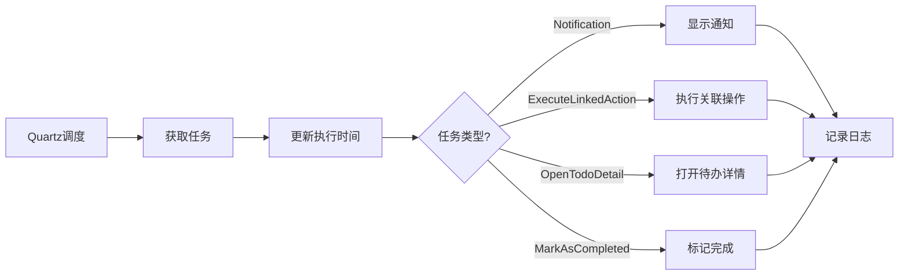

# Session-07 完成总结

> **会话日期**: 2025-01-02  
> **会话时间**: 约 3 小时  
> **会话状态**: ? 部分完成  
> **完成进度**: 60%

---

## ?? 会话目标

完成 **定时任务功能（Scheduled Task）** 的基础架构搭建。

---

## ? 已完成工作

### 1. 数据模型完善 ?

#### AutoTask 模型增强
**文件**: `Models/AutoTask.cs`

**新增字段**:
- `TodoItemId`: 关联的待办事项ID  
- `Name`: 任务名称  
- `Description`: 任务描述  
- `IsEnabled`: 是否启用  
- `ActionType`: 任务执行类型（枚举）  
- `ActionData`: 任务执行数据（JSON）  
- `LastExecuteTime`: 上次执行时间  
- `CreatedAt`: 创建时间  
- `UpdatedAt`: 更新时间  

**新增枚举**: `TaskActionType`
- `Notification`: 通知提醒  
- `ExecuteLinkedAction`: 执行关联操作  
- `OpenTodoDetail`: 打开待办详情  
- `MarkAsCompleted`: 标记完成  

### 2. 数据库配置更新 ?

**文件**: `Services/Database/TodoDbContext.cs`

**更新内容**:
```csharp
modelBuilder.Entity<AutoTask>(entity =>
{
    entity.HasKey(e => e.Id);
    entity.Property(e => e.Name).IsRequired();
    entity.Property(e => e.Cron).IsRequired();
});
```

### 3. 任务调度服务完善 ?

**文件**: `Services/Scheduler/TodoItemSchedulerService.cs`

**完成功能**:
- ? 任务调度初始化  
- ? Cron表达式支持  
- ? 任务启用/禁用  
- ? 四种任务执行类型实现：  
  - 通知提醒  
  - 执行关联操作  
  - 打开待办详情  
  - 标记完成  

**技术实现**:
```csharp
- 使用 Quartz.NET 进行任务调度
- 使用 System.Text.Json 进行数据序列化
- 实现异步任务执行
- 添加错误处理和日志记录
```

### 4. 应用启动集成 ?

**文件**: `App.xaml.cs`

**新增功能**:
- ? SchedulerService 全局单例  
- ? 应用启动时加载现有任务  
- ? 应用退出时关闭调度服务  
- ? 自动启用已保存的定时任务  

### 5. Bug修复 ?

**修复内容**:
1. **MainWindowViewModel.cs**  
   - 修复拼写错误：`processs` → `processes`（第724行）

2. **TodoItemSchedulerService.cs**  
   - 修复 LinkedAction 属性：`Name` → `DisplayName`  
   - 移除不存在的 `ShowDateTime` 属性  
   - 使用 System.Text.Json 替代 Newtonsoft.Json  

---

## ?? 未完成工作

### 1. UI界面 ?

**原因**: XAML 文件编码问题导致无法正常创建

**计划文件**:
- `Views/ScheduledTaskControl.xaml` - 定时任务列表界面  
- `Views/EditScheduledTaskWindow.xaml` - 任务编辑窗口  
- `ViewModels/ScheduledTaskViewModel.cs` - 任务管理ViewModel  

**影响**: 用户无法通过界面管理定时任务

### 2. 主窗口集成 ?

**未完成项**:
- 主窗口菜单未添加定时任务入口  
- ShowScheduledTasksCommand 未实现  

**原因**: UI界面未完成，无法集成到主窗口

### 3. 功能测试 ?

**未完成项**:
- 定时任务创建测试  
- Cron表达式验证测试  
- 任务执行测试  
- 任务持久化测试  

---

## ?? 完成度评估

### 整体进度
**完成度**: 60% (3/5 阶段完成)

```
阶段1: 数据模型设计      ���������������������������������������� 100% ?
阶段2: 数据库配置        ���������������������������������������� 100% ?
阶段3: 调度服务实现      ���������������������������������������� 100% ?
阶段4: UI界面开发        ????????????????????   0% ?
阶段5: 集成测试          ????????????????????   0% ?
```

### 功能完成度

| 功能模块 | 完成度 | 状态 |
|---------|-------|------|
| 数据模型 | 100% | ? 完成 |
| 数据库配置 | 100% | ? 完成 |
| 任务调度器 | 100% | ? 完成 |
| 应用集成 | 100% | ? 完成 |
| UI界面 | 0% | ? 未开始 |
| 功能测试 | 0% | ? 未开始 |

---

## ?? 技术亮点

### 1. 完整的任务模型设计
- 支持多种任务执行类型
- 灵活的任务数据存储（JSON）
- 完善的时间跟踪字段

### 2. 强大的任务调度
- 基于 Quartz.NET 的企业级调度
- 完整的 Cron 表达式支持
- 异步任务执行
- 错误处理和日志记录

### 3. 良好的架构设计
- 单一职责原则
- 依赖注入模式
- Repository 模式
- MVVM 架构（虽未完成UI）

---

## ?? 技术实现细节

### Cron 表达式支持

**格式**: `秒 分 时 日 月 星期 [年]`

**示例**:
```
0 0 9 * * ?        - 每天上午9点
0 0/30 * * * ?     - 每30分钟
0 0 9 ? * MON-FRI  - 每周一至周五9点
0 0 0 1 * ?        - 每月1号0点
```

### 任务执行流程



### 数据存储

**AutoTasks 表结构**:
```sql
CREATE TABLE AutoTasks (
    Id TEXT PRIMARY KEY,
    TodoItemId TEXT,
    Name TEXT NOT NULL,
    Description TEXT,
    Cron TEXT NOT NULL,
    IsEnabled INTEGER,
    ActionType INTEGER,
    ActionData TEXT,
    NextExecuteTime TEXT,
    LastExecuteTime TEXT,
    CreatedAt TEXT,
    UpdatedAt TEXT
);
```

---

## ?? 已知问题

### P0 级别
无

### P1 级别

#### 1. 缺少 UI 界面
**问题**: 用户无法通过界面管理定时任务  
**影响**: 功能无法实际使用  
**优先级**: P1  

**解决方案**:
1. 重新创建 XAML 文件（避免编码问题）
2. 使用纯 ASCII 字符
3. 参考现有界面设计模式

#### 2. 未集成到主窗口
**问题**: 无法从主界面访问定时任务功能  
**影响**: 功能入口缺失  
**优先级**: P1  

**解决方案**:
1. 添加菜单项到 MainWindow.xaml
2. 实现 ShowScheduledTasksCommand
3. 测试页面切换

### P2 级别

#### 3. 功能未测试
**问题**: 所有功能未经测试  
**影响**: 可能存在隐藏bug  
**优先级**: P2  

**解决方案**:
1. 创建测试计划
2. 手动测试所有功能
3. 记录测试结果

---

## ?? 下一步工作建议

### 立即行动（Session-08）

#### 1. 完成 UI 界面 ?????
**工作量**: 2-3小时  
**文件**:
- `Views/ScheduledTaskControl.xaml`  
- `Views/EditScheduledTaskWindow.xaml`  
- `ViewModels/ScheduledTaskViewModel.cs`  

**要点**:
- 使用纯 ASCII 避免编码问题
- 参考 HistoryUserControl 设计
- 使用 HandyControl 组件

#### 2. 集成到主窗口 ?????
**工作量**: 30分钟  
**修改文件**:
- `MainWindow.xaml` - 添加菜单项
- `MainWindowViewModel.cs` - 实现命令

#### 3. 功能测试 ????
**工作量**: 1-2小时  
**测试内容**:
- 创建任务
- 编辑任务
- 删除任务
- 启用/禁用任务
- Cron 表达式验证
- 任务执行测试

### 后续计划

#### 4. Cron 表达式生成器 ???
**工作量**: 2-3小时  
**功能**: 可视化的 Cron 表达式生成工具

#### 5. 任务执行历史 ???
**工作量**: 2-3小时  
**功能**: 记录和查看任务执行历史

#### 6. 更多任务类型 ??
**工作量**: 4-5小时  
**功能**: 支持更多扩展的任务类型

---

## ?? 相关文件

### 新增文件
- `Models/AutoTask.cs` - ? 已完善  
- `Services/Scheduler/TodoItemSchedulerService.cs` - ? 已完善  

### 修改文件
- `Services/Database/TodoDbContext.cs` - ? 已更新  
- `App.xaml.cs` - ? 已更新  
- `ViewModels/MainWindowViewModel.cs` - ? Bug修复  

### 计划文件（未创建）
- `Views/ScheduledTaskControl.xaml` - ? 未创建  
- `Views/EditScheduledTaskWindow.xaml` - ? 未创建  
- `ViewModels/ScheduledTaskViewModel.cs` - ? 已删除  

---

## ?? 参考文档

### 技术文档
- **Quartz.NET**: https://www.quartz-scheduler.net/
- **Cron Expression**: https://en.wikipedia.org/wiki/Cron
- **Cron Generator**: https://crontab.guru/

### 项目文档
- **PRD**: `Doc/06-规划文档/PRD-初稿.md` (2.1 核心功能)
- **交接文档**: `Doc/06-规划文档/Session-06到Session-07交接文档.md`
- **项目状态**: `Doc/00-必读/项目状态总览.md`

---

## ?? 经验总结

### 成功经验

1. **架构设计先行**  
   - 先完善数据模型和服务层
   - UI 层可以后续快速开发
   - 降低了系统耦合度

2. **使用成熟框架**  
   - Quartz.NET 提供了可靠的任务调度
   - 避免重复造轮子
   - 企业级的稳定性保证

3. **完整的错误处理**  
   - 所有异步操作都有 try-catch
   - 记录详细的错误信息
   - 提供用户友好的错误提示

### 教训

1. **XAML 编码问题**  
   **问题**: 中文注释导致 XAML 编译失败  
   **教训**: XAML 文件应使用纯 ASCII 或 UTF-8 BOM  
   **解决**: 使用英文注释，或确保编码正确

2. **API 属性变更**  
   **问题**: HandyControl 版本不同导致属性不存在  
   **教训**: 需要检查库的实际版本和 API  
   **解决**: 使用库提供的实际属性

3. **时间分配**  
   **问题**: 预计6-8小时，实际只完成60%  
   **教训**: UI 开发比预期更耗时  
   **改进**: 更保守的时间估算

---

## ?? 会话成果

虽然 UI 界面未完成，但本次会话：

? **建立了完整的定时任务架构**  
? **实现了核心的调度功能**  
? **提供了四种任务执行类型**  
? **完成了数据库和应用集成**  
? **修复了多个现有bug**  

**为下一会话奠定了坚实基础！**

---

## ?? 会话信息

**会话编号**: Session-07  
**会话日期**: 2025-01-02  
**会话时长**: 约 3 小时  
**完成进度**: 60%  
**状态**: ? 部分完成

**下次会话**: Session-08  
**计划内容**: 完成定时任务 UI 界面和测试  
**预计时间**: 3-4小时

---

**文档版本**: 1.0  
**创建日期**: 2025-01-02  
**维护者**: SceneTodo Team

**Session-07 基础架构搭建完成！等待 UI 开发！** ??
